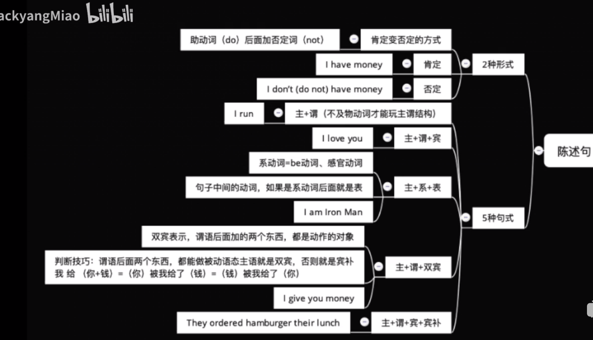

# 简单句

## 预览




## 简单句分类

* 陈述句
* 疑问句
* 感叹句
* 祈使句


## 陈述句

### 陈述句 5 种句型

* 主 + 谓

  ```
  I run.
  ```

* 主 + 谓 + 宾

  ```
  I love you.
  ```

* 主 + 系 + 表

  ```
  I am stupid.
  ```

* 主 + 谓 + 宾 + 双宾

  ```
  I give you(间宾) money(直宾).
  ```

* 主 + 谓 + 宾 + 宾补

  ```
  They ordered hamburger for their lunch.(汉堡是他们的午餐，是对汉堡的补充)
  ```

  

### 肯定式

```
I have money.
```


### 肯定式变否定

助动词（do）后面加否定词（not）

```
I don't (do not) have money.
```


## 疑问句

### 一般疑问句

一般疑问句，可以用yes、no回答。

陈述句变一般疑问句三种方式：

* 提前系动词（be动词、感官动词），主 + 系 + 表  =>  系 + 主 + 表

  ```
  You are an idiot. 
  => Are you an idiot?
  回答：Yes,I am./No,I'm not.
  ```

* 提前助动词（do、have、shall等）， 主 + 谓 + (宾)  =>  助动词 + 主 + 动词原形 + 其它

   ```
  You have got light bulbs.
  => Have you got light bulbs?
  回答：Yes,I have./No,I'm haven't.
  ```

* 提前情态动词（can、may、will等），主 + 情态动词 + 动词原形 + 其它  =>   情态动词 + 主 + 动词原形 + 其它

  ```
  You can play football.
  => Can you play football?
  回答：Yes,I can./No,I can't.
  ```


### 特殊疑问句

不可以用yes、no来回答

**特殊疑问词**

* Who 提问人：Who's next？（谁下一个？）
* Whose 提问所属：whose car is this?（这是谁的车）
* Whom 提问宾格人：Whom did you choose for our team leader?（你选谁当我们队长？）
* What 提问事情属性：What time is it?（几点了？）
* When 提问时间：When can we start working?（我们什么时候可以开始工作？）
* Where 提问地点：Where is the bathroom?（卫生间在哪？）
* Why 提问原因：Why did he do it?（他为什么做这个？）
* How 提问方式数量：How heavy is it?（它有多重？）
* How much/many 多少：How much longer?（有多远？）
* Which 提问选择：Which is your choice?（你选哪个？）


### 选择疑问句

不可以用yes、no回答，选择疑问用or连接，提问两个以上的句子内容供选择。

```
Do you like to play football or basketball?
回答：I like to play football./I like to play basketball.
```


### 反义疑问句

可以用yes、no回答，前肯后否，前否后肯。

```
He is your teacher,isn't he? （他是你的老师，不是吗？）
回答：Yes,he is./No,he isn't.

He isn't your teacher,is he? （他不是你的老师，是吗？）
回答：Yes,he is./No,he isn't.
（如果他确实不是你的老师，你要回答后者——No,he isn't.）
```


祈使句反义疑问句（用will you和won't you）。

```
Open the door, wont'you? （打开门，好吗？）
Don't open the door,will you? （不要打开门，好吗？）
```

用shall we和will you（let's用shall we，let us用will you）

```
Let's go to school,shall we?
Let us go outside,will you?

Let's don't go out,shall we?
Don't let us go there,will you?
```

must + 反义疑问句，must表“必须”时，反义疑问句用mustn't?/needn't?

```
He must study hard at English,mustn't he?
```

must表推测（肯定）时，反义疑问句用must后动词的否定提问。

```
You must be joking,aren't you?
```

感叹句 + 反义疑问句，通常用感叹句陈述，用否定式提问，前肯后否。

```
What a lovely girl,isn't she?
```

否定词 + 反义疑问句，陈述句有否定词，反义疑问句用肯定提问。

> 常见的否定词：hardly、never、seldom、little、few、nowhere、nothing

```
He harly goes to school,does he?
```

复合句 + 反义疑问句，对主句的主语提问。

```
She never told you that she had a baby,did she?
```

宾语从句 + 反义疑问句，对从句的主语相关提问。

```
I don't imgaine he has got it, has he?
```


## 感叹句

### What感叹句

What + a/an + 形容词 + 可数名词单数 + 主语 + 谓语。

```
What a beautiful photo it is!
```

What + 形容词 + 不可数名词 /名词复数 + 主语 + 谓语。

```
What cleanly water it is!
What brilliant dogs they are!
```


### How感叹句

How + 形容词/副词 + 主语 + 谓语。

```
How careful he is!
How fast he runs!
```

How + 形容词 + a/an + 可数名词单数 + 主语 + 谓语。

```
How cute a dog it is!
```


### 语气词 + 感叹句

```
Wow!That's totally awesome!
Oh!You're Peter!
```


## 祈使句

### 命令、警告

```
Get out!
Be quiet,please.
Be careful.
```


### 请求、祝愿

```
Have a good day.
Let me help you.
```

