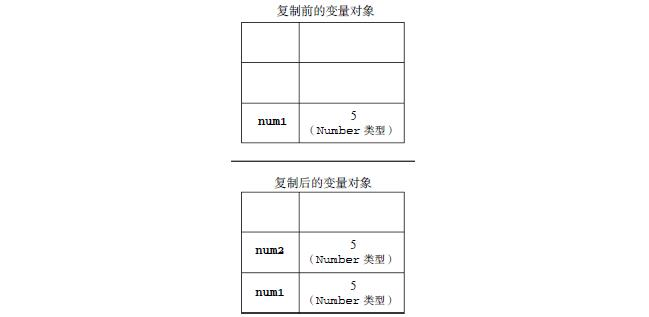

# 第 4 章 变量、作用域和内存问题

按照ECMA-262 的定义，JavaScript 的变量与其他语言的变量有很大区别。

JavaScript 变量松散类型的本质，决定了它只是在特定时间用于保存特定值的一个名字而已。

由于不存在定义某个变量必须要保存何种数据类型值的规则，变量的值及其数据类型可以在脚本的生命周期内改变。

尽管从某种角度看，这可能是一个既有趣又强大，同时又容易出问题的特性，但JavaScript 变量实际的复杂程度还远不止如此。


## 4.0 预览

JavaScript变量可以用来保存两种类型的值，基本类型值和引用类型值，它们具有以下特点：

* 基本类型值在内存中占据固定大小的空间，因此被保存在栈内存中；
* 从一个变量向另一个变量复制基本类型的值，会创建这个值的副本；
* 引用类型的值是对象，保存在对内存中；
* 包括引用类型值的变量实际上包含的并不是对象本身，而是一个指向该对象的指针；
* 从一个变量向另一个变量复制引用类型的值，复制的其实是指针，因此两个变量最终都指向同一个对象；
* 确定一个值是那种基本类型可以用`typeof`操作符，而确定一个值是哪种引用类型可以用`instanceof`操作符。

所有变量（包括基本类型和引用类型）都存在于一个执行环境（也称为作用域）当中，这个执行作用域决定了变量的生命周期，以及哪一部分代码可以访问其中的变量：

* 执行环境有全局执行环境和函数执行环境之分；
* 每次进入一个新执行环境，都会创建一个用于搜索变量和函数的作用域链；
* 函数的局部环境不仅有权访问函数作用域中的变量，而且有权访问其包含环境，乃至全局环境；
* 全局环境不能访问局环境；
* 变量的执行环境有助于确定应该何时释放内存；

JavaScript自动垃圾回收机制总结：

* 离开作用域的值将被自动标记为可以回收，因此将在垃圾收集其间被删除；
* “标记清楚”是目前最主流的垃圾收集算法，这种算法的思想是给当前不使用的值加上标记后再回收其内存；
* 另一种“引用计数”算法，会因为”循环引用“而导致内存泄漏；
* 解除变量的引用不仅有助于消除循环引用现象，而且对垃圾收集也有好处。为了确保有效的回收内存，应该及时解除不再使用的全局对象、全局对象属性以及循环引用变量的引用。


## 4.1 基本类型和引用类型的值

JavaScript 变量松散类型的本质，决定了它只是在特定时间用于保存特定值的一个名字而已。

变量的值及其数据类型可以在脚本的生命周期内改变，这可能是一个既有趣又强大，同时又容易出问题的特性。

变量可能包含两种不同数据类型的值：**基本类型值**和**引用类型值**

5个基本数据类型：**Undefined**、**Null**、**Boolean**、**Number** 和**String**

引用类型的值是保存在内存中的对象，JavaScript 不允许直接访问内存中的位置，也就是说不能直接操作对象的内存空间。

在操作对象时，实际上是在操作对象的引用而不是实际的对象。为此，引用类型的值是按引用访问的。

<font color="eb2f06">🤔：这种说法不严密，当复制保存着对象的某个变量时，操作的是对象的引用。但在为对象添加属性时，操作的是实际的对象。</font>


### 4.1.1 动态的属性

对于引用类型的值，我们可以为其添加属性和方法，也可以改变和删除其属性和方法：

```javascript
var person = new Object();
person.name = "Nicholas";
alert(person.name); //"Nicholas"
```

但是，我们不能给基本类型的值添加属性，尽管这样做不会导致任何错误：

```javascript
var name = "Nicholas";
name.age = 27;
alert(name.age); //undefined
```

这说明只能给引用类型值动态地添加属性，以便将来使用。


### 4.1.2 复制变量值

基本类型的复制：会在变量对象上创建一个新值，然后把该值复制到为新变量分配的位置上：

```javascript
var num1 = 5;
var num2 = num1;
```

在此，num1 中保存的值是5。当使用num1 的值来初始化num2 时，num2 中也保存了值5。但num2中的5 与num1 中的5 是完全独立的，该值只是num1 中5 的一个副本。



当从一个变量向另一个变量复制引用类型的值时，同样也会将存储在变量对象中的值复制一份放到为新变量分配的空间中。不同的是，这个值的副本实际上是一个**指针**，而这个指针指向存储在堆中的一个对象。

复制操作结束后，两个变量实际上将引用同一个对象，改变其中一个变量，就会影响另一个变量。

```javascript
var obj1 = new Object();
var obj2 = obj1;
obj1.name = "Nicholas";
alert(obj2.name); //"Nicholas"
```


### 4.13 传递参数

ECMAScript 中所有函数的参数都是按值传递的。也就是说，把函数外部的值复制给函数内部的参数，就和把值从一个变量复制到另一个变量一样。

基本类型传递参数：

```javascript
function addTen(num) {
    num += 10;
    return num;
}
var count = 20;
var result = addTen(count);
alert(count); //20，没有变化
alert(result); //30
```

在函数内部，参数num 的值被加上了10，但这一变化不会影响函数外部的count 变量。

引用类型传递参数：

```javascript
function setName(obj) {
    obj.name = "Nicholas";
}
var person = new Object();
setName(person);
alert(person.name); //"Nicholas"
```

在这个函数内部，obj 和person 引用的是同一个对象。换句话说，即使这个变量是按值传递的，obj 也会按引用来访问同一个对象。于是，当在函数内部为obj 添加name属性后，函数外部的person 也将有所反映。

为了证明对象是按值传递的，我们再看一看下面这个经过修改的例子：

```javascript
function setName(obj) {
    obj.name = "Nicholas";
    obj = new Object();
    obj.name = "Greg";
}
var person = new Object();
setName(person);
alert(person.name); //"Nicholas"
```

如果person 是按引用传递的，那么person 就会自动被修改为指向其name 属性值为"Greg"的新对象。但是，当接下来再访问person.name 时，显示的值仍然是"Nicholas"。这说明即使在函数内部修改了参数的值，但原始的引用仍然保持未变。

实际上，当在函数内部重写obj 时，这个变量引用的就是一个局部对象了。而这个局部对象会在函数执行完毕后立即被销毁。


### 4.1.4 检测类型

为了知道变量是什么类型的对象，ECMAScript提供了instanceof 操作符，其语法如下所示：

```
result = variable instanceof constructor
```

如果变量是给定引用类型（根据它的原型链来识别；第6 章将介绍原型链）的实例，那么instanceof 操作符就会返回true。

```javascript
alert(person instanceof Object); // 变量person 是Object 吗？
alert(colors instanceof Array); // 变量colors 是Array 吗？
alert(pattern instanceof RegExp); // 变量pattern 是RegExp 吗？
```

根据规定，**所有引用类型的值都是Object 的实例**。因此，在检测一个引用类型值和Object 构造函数时，instanceof 操作符始终会返回true。当然，如果使用instanceof 操作符检测基本类型的值，则该操作符始终会返回false，因为**基本类型不是对象**。


## 4.2 执行环境及作用域

**执行环境**（execution context，为简单起见，有时也称为“环境”）是JavaScript 中最为重要的一个概念。执行环境定义了变量或函数有权访问的其他数据，决定了它们各自的行为。

每个执行环境都有一个与之关联的**变量对象**（variable object），环境中定义的所有变量和函数都保存在这个对象中。

每个函数都有自己的执行环境。当执行流进入一个函数时，函数的环境就会被推入一个环境栈中。而在函数执行之后，栈将其环境弹出，把控制权返回给之前的执行环境。ECMAScript 程序中的执行流正是由这个方便的机制控制着。

当代码在一个环境中执行时，会创建变量对象的一个**作用域链**（scope chain）。作用域链的用途，是保证对执行环境有权访问的所有变量和函数的有序访问。作用域链的*前端*，始终都是当前执行的代码所在环境的变量对象。如果这个环境是函数，则将其**活动对象**（activation object）作为变量对象。活动对象在最开始时只包含一个变量，即arguments 对象（这个对象在全局环境中是不存在的）。作用域链中的下一个变量对象来自包含（外部）环境，而再下一个变量对象则来自下一个包含环境。这样，一直延续到全局执行环境；全局执行环境的变量对象始终都是作用域链中的最后一个对象。

标识符解析是沿着作用域链一级一级地搜索标识符的过程。搜索过程始终从作用域链的*前端*开始，然后逐级地向后回溯，直至找到标识符为止（如果找不到标识符，通常会导致错误发生）。


### 4.2.1 延长作用域链

执行环境的类型总共只有两种——全局和局部（函数），但还是有其他办法来延长作用域链。

当执行流进入下列任何一个语句时，作用域链就会得到加长：

- try-catch 语句的catch 块
- with 语句

对with 语句来说，会将指定的对象添加到作用域链中。

对catch 语句来说，会创建一个新的变量对象。

```javascript
function buildUrl() {
    var qs = "?debug=true";
    with(location){
        var url = href + qs;
    }
    return url;
}
```

在此，with 语句接收的是location 对象，因此其变量对象中就*包含*了 location 对象的所有属性和方法，而这个变量对象被添加到了作用域链的前端。当在with 语句中引用变量href 时（实际引用的是location.href），可以在当前执行环境的变量对象中找到。当引用变量qs 时，引用的则是在buildUrl()中定义的那个变量，而该变量位于函数环境的变量对象中。至于with 语句内部，则定义了一个名为url 的变量，因而url 就成了函数执行环境的一部分，所以可以作为函数的值被返回。


### 4.2.2 没有块级作用域

在其他类C 的语言中，由花括号封闭的代码块都有自己的作用域。

在ES6之前，JavaScript 没有块级作用域经常会导致理解上的困惑。

```javascript
if (true) {
    var color = "blue";
}
alert(color); //"blue"
```

这里是在一个if 语句中定义了变量color。如果是在C、C++或Java 中，color 会在if 语句执行完毕后被销毁。但在JavaScript 中，if 语句中的变量声明会将变量添加到当前的执行环境（在这里是全局环境）中。

**1. 声明变量**

使用var 声明的变量会自动被添加到最接近的环境中。在函数内部，最接近的环境就是函数的局部环境；在with 语句中，最接近的环境是函数环境。如果初始化变量时没有使用var 声明，该变量会自动被添加到全局环境。

**2. 查询标识符**

当在某个环境中为了读取或写入而引用一个标识符时，必须通过搜索来确定该标识符实际代表什么。搜索过程从作用域链的前端开始，向上逐级查询与给定名字匹配的标识符。

如果在局部环境中找到了该标识符，搜索过程停止，变量就绪。

如果在局部环境中没有找到该变量名，则继续沿作用域链向上搜索。搜索过程将一直追溯到全局环境的变量对象。

如果在全局环境中也没有找到这个标识符，则意味着该变量尚未声明。

> 变量查询也不是没有代价的。很明显，访问局部变量要比访问全局变量更快，因为不用向上搜索作用域链。
>
> JavaScript 引擎在优化标识符查询方面做得不错，因此这个差别在将来恐怕就可以忽略不计了。


## 4.3 垃圾收集

JavaScript 具有自动垃圾收集机制，这种垃圾收集机制的原理其实很简单：找出那些不再继续使用的变量，然后释放其占用的内存。为此，垃圾收集器会按照固定的时间间隔（或代码执行中预定的收集时间），周期性地执行这一操作。

局部变量只在函数执行的过程中存在。而在这个过程中，会为局部变量在栈（或堆）内存上分配相应的空间，以便存储它们的值。然后在函数中使用这些变量，直至函数执行结束。此时，局部变量就没有存在的必要了，因此可以释放它们的内存以供将来使用。具体到浏览器中的实现，通常有两种策略。


### 4.3.1 标记清除

JavaScript 中最常用的垃圾收集方式是标记清除（mark-and-sweep）。

垃圾收集器在运行的时候会给存储在内存中的所有变量都加上标记（当然，可以使用任何标记方式）。然后，它会去掉环境中的变量以及被环境中的变量引用的变量的标记。而在此之后再被加上标记的变量将被视为准备删除的变量，原因是环境中的变量已经无法访问到这些变量了。最后，垃圾收集器完成内存清除工作，销毁那些带标记的值并回收它们所占用的内存空间。


### 4.3.2 引用计数

另一种不太常见的垃圾收集策略叫做引用计数（reference counting）

引用计数的含义是跟踪记录每个值被引用的次数。当声明了一个变量并将一个引用类型值赋给该变量时，则这个值的引用次数就是1。如果同一个值又被赋给另一个变量，则该值的引用次数加1。相反，如果包含对这个值引用的变量又取得了另外一个值，则这个值的引用次数减1。当这个值的引用次数变成0 时，则说明没有办法再访问这个值了，因而就可以将其占用的内存空间回收回来。这样，当垃圾收集器下次再运行时，它就会释放那些引用次数为零的值所占用的内存。

不过引用计数方法存在一个很严重的问题——循环引用导致内存泄漏，如下例：

```js
 function circularReference() {
   let obj1 = {
   };
   let obj2 = {
    b: obj1
   };
   obj1.a = obj2;
 }
```

上述代码在内存图中的示意图：


代码中的 obj1 这个变量被赋予了 obj1 这个对象的地址，obj1 这个变量就指向了这个 obj1(右上)这个对象，obj1(右上)的引用计数就会加1.当变量 obj1的值不再是 obj1(右上)这个对象的地址时，obj1(右上)这个对象的引用计数就会减1.当这个 obj1（右上）对象的引用计数变成 0 后，垃圾收集器就会将其回收，因为此时没有变量指向你，也就没办法使用你了。

看似很合理的垃圾回收策略为什么会有问题呢？

就是上面讲到的循环引用导致的，下面来分析一下。当 obj1 这个变量执行 obj1 这个对象时，obj1 这个对象的引用计数会加 1，此时引用计数值为 1，接下来 obj2 的 b 属性又指向了 obj1 这个对象，所以此时 obj1 这个对象的引用计数为 2。同理 obj2 这个对象的引用计数也为2.

当代码执行完后，会将变量 obj1 和 obj2 赋值为 null，但是此时 obj1 和 obj2 这两个对象的引用计数都为1，并不为 0，所以并不会进行垃圾回收，但是这两个对象已经没有作用了，在函数外部也不可能使用到它们，所以这就造成了内存泄露。

> [原文](https://www.zhihu.com/search?type=content&q=js%20%E5%BE%AA%E7%8E%AF%E5%BC%95%E7%94%A8)


### 4.3.3 性能问题

垃圾收集器是周期性运行的，而且如果为变量分配的内存数量很可观，那么回收工作量也是相当大的。

IE 的垃圾收集器是根据内存分配量运行的，具体一点说就是256 个变量、4096 个对象（或数组）字面量和数组元素（slot）或者64KB 的字符串。达到上述任何一个临界值，垃圾收集器就会运行。这种实现方式的问题在于，如果一个脚本中包含那么多变量，那么该脚本很可能会在其生命周期中一直保有那么多的变量。而这样一来，垃圾收集器就不得不频繁地运行。

后来IE7修改了这种工作方式：使触发垃圾回收机制的临界值动态调整，如果本次垃圾回收的内存分配量低于15%，则临界值翻倍；如果某次垃圾回收的内存分配量高于85%，则临界值回归初始。

> 事实上，在有的浏览器中可以触发垃圾收集过程，但我们不建议读者这样做。在IE 中，调用`window.CollectGarbage()`方法会立即执行垃圾收集。在Opera 7 及更高版本中，调用`window.opera.collect()`也会启动垃圾收集例程。


### 4.3.4 内存管理

使用具备垃圾收集机制的语言编写程序，开发人员一般不必操心内存管理的问题。但是，JavaScript在进行内存管理及垃圾收集时面临的问题还是有点与众不同。

确保占用最少的内存可以让页面获得更好的性能。而优化内存占用的最佳方式，就是为执行中的代码只保存必要的数据。一旦数据不再有用，最好通过将其值设置为null 来释放其引用——这个做法叫做**解除引用**（dereferencing），如下例：

```js
function createPerson (name) {
    var localPerson = new Object();
    localPerson.name = name;
    
    return localPerson;
}

var globalPerson = createPerson("崔永杰");

// 手动解除globalPerson的引用
globalPerson = null;
```

在这个例子中，变量`globalPerson`不同于函数中`localPerson`一样，它不会在函数结束时被回收，所以需要我们在不使用时手工为它接触引用。

不过，解除一个值的引用并不意味着自动回收该值所占用的内存。解除引用的真正作用是让值脱离执行环境，以便垃圾收集器下次运行时将其回收。